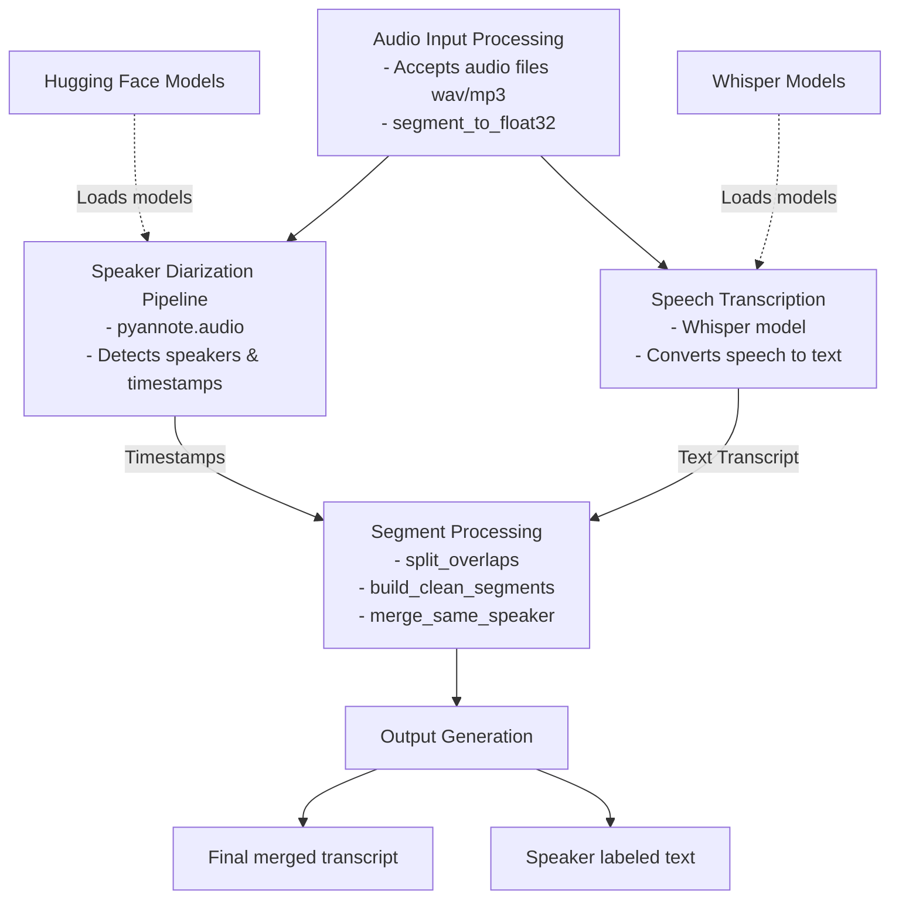

```mermaid
flowchart TD
    %% External Dependencies
    HF[Hugging Face Models]
    WM[Whisper Models]

    %% Components
    A[Audio Input Processing<br/>- Accepts audio files wav/mp3<br/>- segment_to_float32]
    B[Speaker Diarization Pipeline<br/>- pyannote.audio<br/>- Detects speakers & timestamps]
    C[Speech Transcription<br/>- Whisper model<br/>- Converts speech to text]
    D[Segment Processing<br/>- split_overlaps<br/>- build_clean_segments<br/>- merge_same_speaker]
    E[Output Generation]
    
    %% Outputs
    O1[Final merged transcript]
    O2[Speaker labeled text]

    %% Data Flow
    A --> B
    A --> C
    
    %% External Dependency Flow
    HF -.->|Loads models| B
    WM -.->|Loads models| C
    
    B -->|Timestamps| D
    C -->|Text Transcript| D
    
    D --> E
    
    E --> O1
    E --> O2
```
