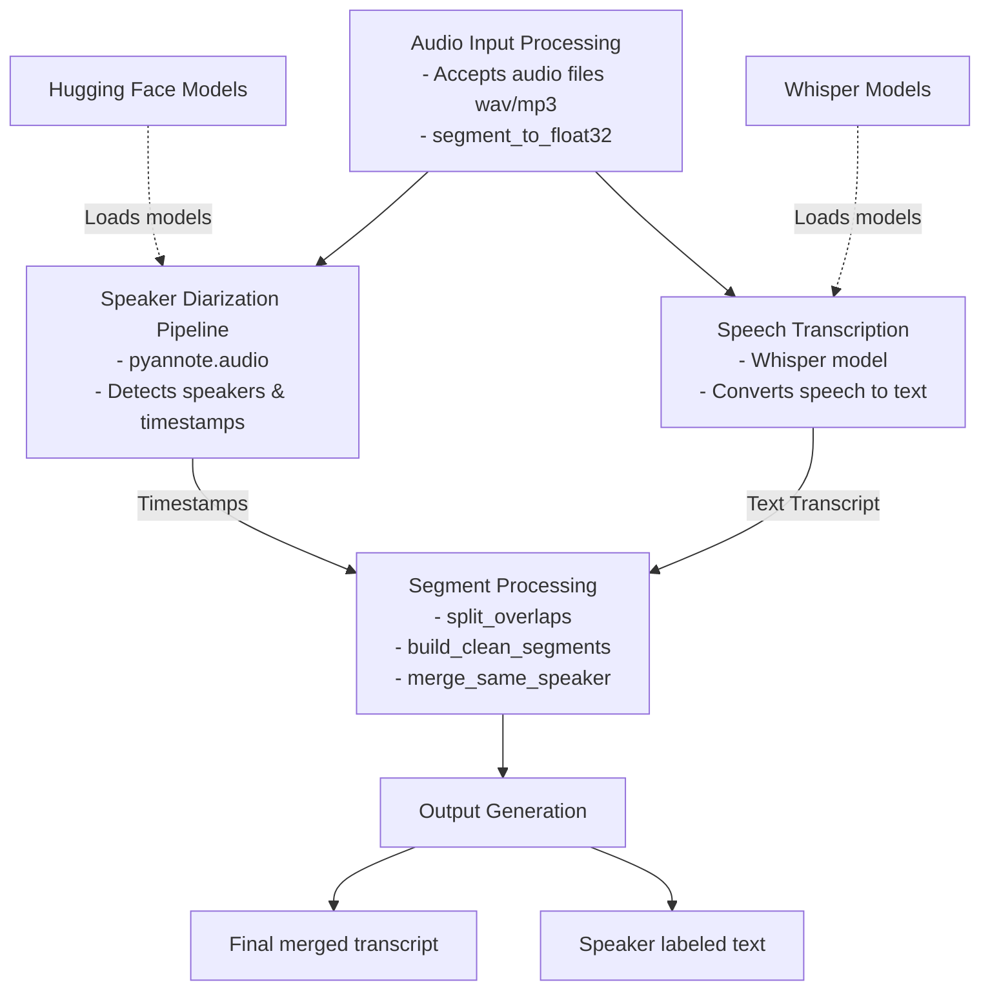

# Architecture Diagram

## System Overview
The Speech Processing System accepts audio input files (such as WAV or MP3) and initially processes them through the Audio Input Processing component, where the audio is converted into the required format using `segment_to_float32()`. The processed audio then flows into two parallel operations: the Speaker Diarization Pipeline and Speech Transcription. 

The Speaker Diarization Pipeline utilizes `pyannote.audio` and loads external models directly from Hugging Face to detect distinct speakers and their precise timestamps. Meanwhile, the Speech Transcription component uses external OpenAI Whisper Models to convert the audio into raw text. 

The outputs from both diarization and transcription are sent to the Segment Processing module. In this module, operations such as `split_overlaps()`, `build_clean_segments()`, and `merge_same_speaker()` are applied to meticulously align the transcribed text with the correct speaker segments. Finally, the Output Generation component consolidates this processed data to deliver the final merged transcript alongside accurate speaker-labeled text.

## Component Descriptions

*   **Audio Input Processing:** This component serves as the entry point of the system. It is responsible for accepting raw audio files in formats like WAV or MP3. It converts the audio into a standard float32 array format via the `segment_to_float32()` function, preparing it for downstream processing.
*   **Speaker Diarization Pipeline:** Operating in parallel with transcription, this pipeline identifies "who spoke when." It leverages `pyannote.audio` and external models loaded from Hugging Face to process the audio and output timestamps along with unique speaker IDs.
*   **Speech Transcription:** This component runs concurrently with diarization and converts spoken language into text. It loads the powerful Whisper models to transcribe the audio data, producing a raw text transcript.
*   **Segment Processing:** Acting as the synchronization and alignment center, this module takes timestamps from the diarization pipeline and raw text from the transcription component. Through tasks like `split_overlaps()`, `build_clean_segments()`, and `merge_same_speaker()`, it aligns text phrases to particular speakers perfectly.
*   **Output Generation:** The final system stage handles formatting. It gathers the cleaned and aligned segments and constructs the ultimate outputs: a final, human-readable merged transcript, and detailed speaker-labeled text.
*   **External Dependencies:**
    *   **Hugging Face Models:** Provides external diarization models and pipelines necessary for `pyannote.audio`.
    *   **Whisper Models:** The specific Automatic Speech Recognition (ASR) framework/models responsible for high-accuracy text transcription.

