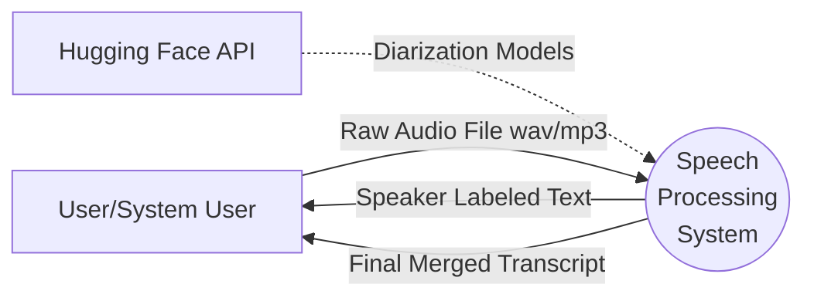
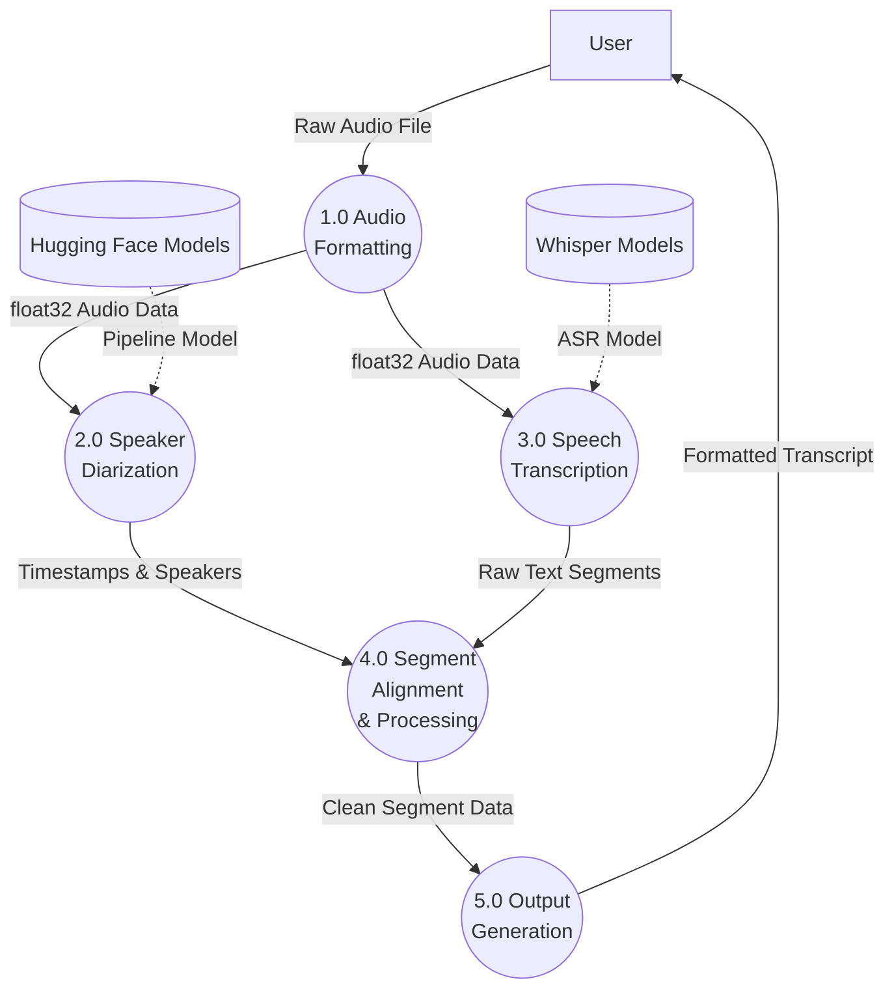
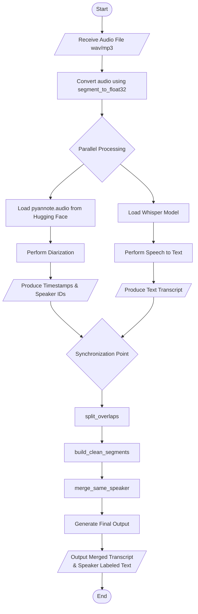

```mermaid
flowchart LR
    %% Entities
    U[User/System User]
    HF[Hugging Face API]
    
    %% Processes
    P1((Speech<br/>Processing<br/>System))
    
    %% Data Flows
    U -->|Raw Audio File wav/mp3| P1
    HF -.->|Diarization Models| P1
    P1 -->|Speaker Labeled Text| U
    P1 -->|Final Merged Transcript| U
```

```mermaid
flowchart TD
    %% External Entities & Data Stores
    User[User]
    HF[(Hugging Face Models)]
    WM[(Whisper Models)]
    
    %% Processes
    P1((1.0 Audio<br/>Formatting))
    P2((2.0 Speaker<br/>Diarization))
    P3((3.0 Speech<br/>Transcription))
    P4((4.0 Segment<br/>Alignment<br/>& Processing))
    P5((5.0 Output<br/>Generation))
    
    %% Data Flows
    User -->|Raw Audio File| P1
    P1 -->|float32 Audio Data| P2
    P1 -->|float32 Audio Data| P3
    
    HF -.->|Pipeline Model| P2
    WM -.->|ASR Model| P3
    
    P2 -->|Timestamps & Speakers| P4
    P3 -->|Raw Text Segments| P4
    
    P4 -->|Clean Segment Data| P5
    
    P5 -->|Formatted Transcript| User
```

```mermaid
flowchart TD
    Start([Start]) --> Input[/Receive Audio File wav/mp3/]
    
    Input --> Convert[Convert audio using segment_to_float32]
    
    Convert --> Split{Parallel Processing}
    
    %% Parallel Path 1: Diarization
    Split --> LoadDiarization[Load pyannote.audio from Hugging Face]
    LoadDiarization --> ProcessDiar[Perform Diarization]
    ProcessDiar --> OutputTime[/Produce Timestamps & Speaker IDs/]
    
    %% Parallel Path 2: Transcription
    Split --> LoadWhisper[Load Whisper Model]
    LoadWhisper --> ProcessTrans[Perform Speech to Text]
    ProcessTrans --> OutputText[/Produce Text Transcript/]
    
    %% Sync point
    OutputTime --> Sync{Synchronization Point}
    OutputText --> Sync
    
    Sync --> Clean[split_overlaps]
    Clean --> BuildSeg[build_clean_segments]
    BuildSeg --> Merge[merge_same_speaker]
    
    Merge --> GenOut[Generate Final Output]
    GenOut --> FinalOutput[/Output Merged Transcript \n & Speaker Labeled Text/]
    
    FinalOutput --> End([End])
```
